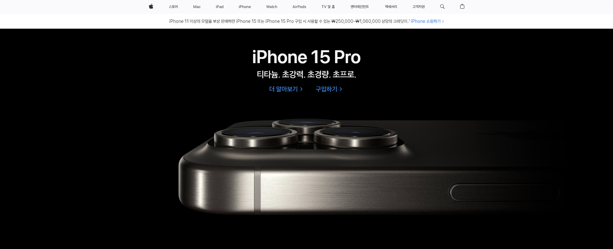

# 애플 코리아 (랜딩 페이지) 클론

## 선정 배경

선망받는 테크 기업의 개발자 들은 어떻게 개발하는지 알고 싶었습니다. 

## 애플 사이트를 클론 하면서 느낀점

타이포그래피 에세이를 쓴 에릭 슈피커만이 디자인은 유용함과 미의 타협점을 찾는 것이라고 했듯이, 애플 사이트는 이러한 기준을 이상적으로 지키고 있습니다. 거추장하고 쓸모 없다고 여겨지는 것은 모두 소거하고, 오직 필요에 의한 UI만 남겨두었다는 인상을 받았습니다. 가장 흥미로웠던 디테일은 아무래도 트랜지션이 일어나는 지점이었는데요. 애플의 트랜지션은 절묘한 딜레이를 주어, 너무 경박하지도, 너무 무겁지도 않은, 매우 적절하며 부드러운 무게감을 완성시킵니다. 특히 네브바에 마우스를 Hover 했을 때 아래로 펼쳐지는 메뉴 박스와, 그 내부의 UI들이 사용자와 상호작용 한 뒤 발생하는 추가적인 트랜지션이 지켜보면, 그 퀄리티에 놀라움을 금치 못합니다. 또한 이 사이트는 컴포넌트 재활용 측면에서도 아주 우수하며, 이는 사용자가 콘텐츠를 감상하는데 통일감을 느낄 수 있도록 합니다. 구조의 단순함은 단조롭지 않으며, 다양한 성격을 가진 양질의 콘텐츠들로 박스를 채워 리듬감을 더합니다. 애플의 네모는 날카롭지 않으며, 둥근 네모는 유치하지 않습니다. 모든 것이 적절합니다. 다만, 스크롤 이벤트를 활용한 제품 소개 페이지는 (기술력과 브랜드 이미지의 과시가 합당한 페이지라는 것을 인지하고 있음에도 불구하고) 가끔은 너무 실험적이며 과하며 불편하고 무겁습니다. 광고 영상과 웹 페이지는 달라야 합니다. 유저의 편의를 좀 더 고려한다면, 어떤 방식으로 웹에 제품을 디스플레이 해야 할까요. 애플은 자신들이 오프라인 스토어에 가꾸어낸 편리함을 자신들의 사이트에서도 좀 더 차용할 필요가 있는 것 같습니다.

## 클론을 하며 애먹었던 부분들

애플의 사이트는 미디어쿼리가 일어날 때 마다 멋지고 깔끔하게 정렬됩니다. 기존에 사용자가 상호작용하던 UI가 있더라도, 화면의 레이아웃 구조가 바뀔 때 마다 유저가 사용하기 전 상태로 초기화 됩니다. 아무리 어질러 놓아도 금새 정리되는 마법의 방과 같습니다. 하지만 분명 노력없는 마법은 일어나지 않습니다. 자바스크립트와 미디어 쿼리로 수차례의 실패를 경험하고 나서야, (제 기준에서 그나마 수용 가능할 정도의) 반응형 웹이 구현되었습니다. 하지만 아직 실제 사이트 만큼 부드러운 전환을 만들어 내지는 못해 정말 아쉽습니다. 추후에 리팩토링 해 볼 예정입니다.

## 추가적으로 시도해 볼 수 있는 것들

Flutter를 활용한 애플 제품 페이지 클론 영상을 본 적이 있습니다. 해당 페이지의 스크롤 이벤트에서 불편함을 느꼈는데, 클론을 진행해 본다면 나름대로의 개선 방향을 모색해 볼 수도 있을 것 같습니다.

